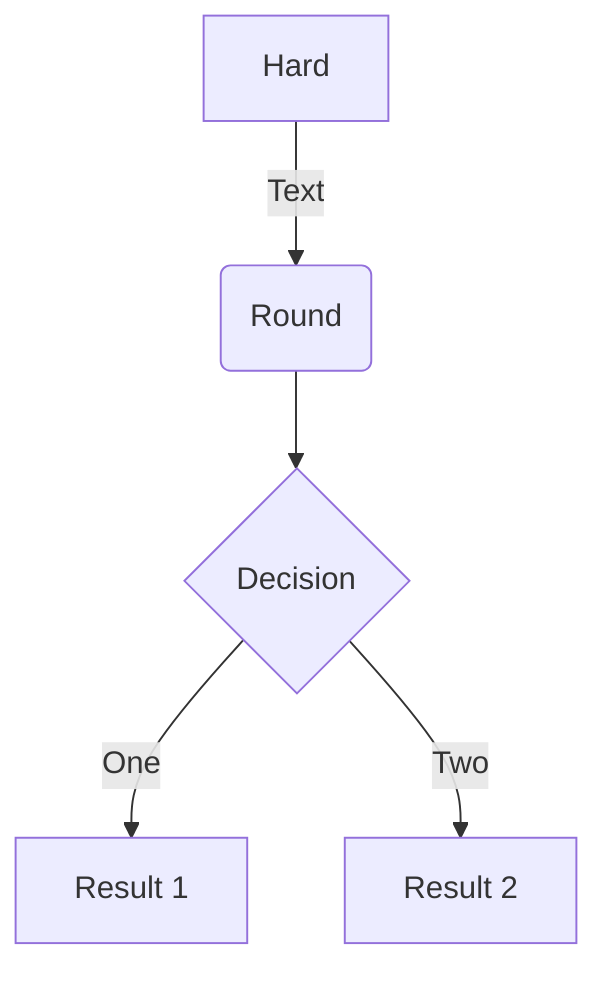

# PushDep

*PushDep* is a concurrent executor for hierarchical tasks, that can also be used as a basic message queue.

*PushDep* has a learning curve of 5 minutes and is up and runnning as soon as you *npm-installed* it in your project.

The library targets small to mid size projects that may not want to use a database, or a distributed in-memory cache. Nevertheless, it works well with some of the databases supported by typeORM.

*PushDep* is built using TypeScript and targets Node JS.

*PushDep* implements an internal in-memory in-process store that can be used for single processor implementation use cases. For more complex use cases, *PushDep* implements a central SQL store supporting some of the SQL datasources supported by typeORM (as of today, this has only been tested with postgreSQL).

Concurrency is set at the tasks level and at the workers level.

Usage: 

Available implementations:
1. In-memory
2. TypeORM

Deployment examples:
Architecture examples:

