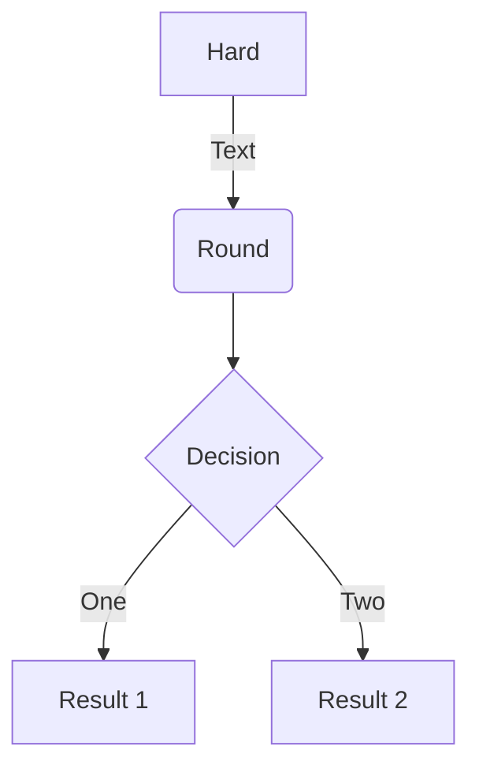
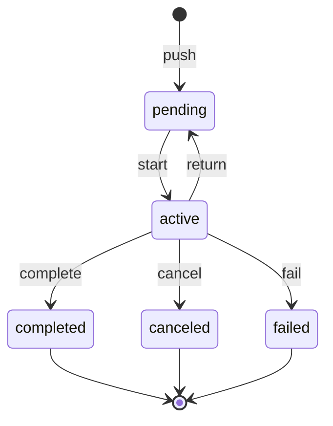
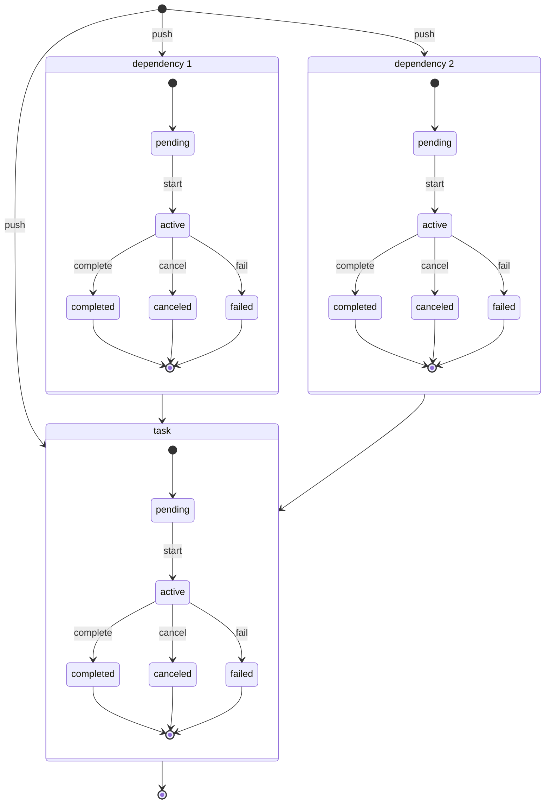

# PushDep

*PushDep* is a concurrent executor for hierarchical tasks (tasks that *depend* on other tasks). It can also be used as a message queue, a workflow engine or a process manager.

It has a learning curve of 5 minutes and is up and runnning as soon as you *npm-installed* it in your project.

The library targets small to mid size projects that may not want to use a database, or a distributed in-memory cache. Nevertheless, it works well with some of the databases supported by typeORM.

It is built using TypeScript and targets Node JS.

It implements an internal in-memory in-process store that can be used for single processor implementation use cases. For more complex use cases, *PushDep* implements a central SQL store supporting some of the SQL datasources supported by typeORM (as of today, this has only been tested with PostgreSQL).

## Installation

```bash
npm install @almiris/pushdep 
```

## Quickstart
The quickstart executes the tasks hierarchy described below.


```typescript 
it('It should execute a simple demo', async () => {
    const pushDep = new InMemoryPushDep();

    const executionPath = [];

    const workerFunction = async (worker: PushDepWorker, task: PushDepTask, pushDep: PushDep) => {
        executionPath.push(task.id);
        await pushDep.completeAsync(task);
    };

    const workerFoo = new PushDepWorker(pushDep, { kind: "foo", idleTimeoutMs: 100 }, workerFunction);
    workerFoo.startAsync();

    const workerBar = new PushDepWorker(pushDep, { kind: "bar", idleTimeoutMs: 100 }, workerFunction);
    workerBar.startAsync();

    await pushDep.pushAsync({ kind: "foo", id: "1" });
    await pushDep.pushAsync({ kind: "foo", id: "2" });
    await pushDep.pushAsync({ kind: "foo", id: "3" });
    await pushDep.pushAsync({ kind: "bar", id: "4", dependencyIds: ["1", "2"] });
    await pushDep.pushAsync({ kind: "bar", id: "5", dependencyIds: ["1", "3"]});
    await pushDep.pushAsync({ kind: "foo", id: "6", dependencyIds: ["4", "5"] });

    await sleep(1000);

    await workerFoo.stopAsync();
    await workerBar.stopAsync();

    expect(executionPath.join("")).toBe("123456");
    expect.assertions(1);
});
```

## In-memory PushDep

## SQL PushDep

## Workers

## Concurrency

## Task lifecycle

### Task with dependencies

## In-process deployment

## Multi-process deployment

