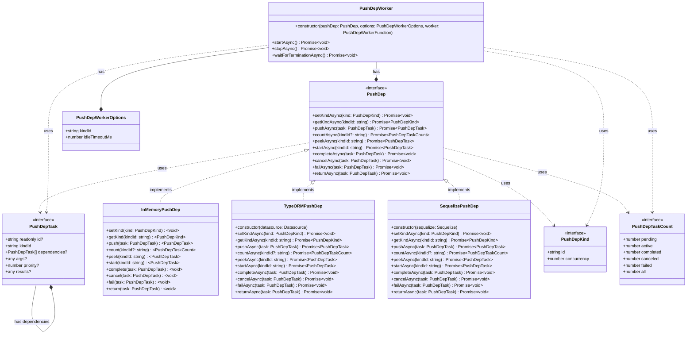

# PushDep

*PushDep* is a concurrent executor for hierarchical tasks (tasks that *depend* on other tasks). It can also be used as a message queue, a workflow engine or a process manager.

It has a learning curve of 5 minutes and is up and runnning as soon as you *npm-installed* it in your project.

The library targets small to mid size projects that may not want to use a database, or a distributed in-memory cache. Nevertheless, it works well with some of the databases supported by typeORM or Sequelize.

It is built using TypeScript and targets Node JS.

It implements an internal in-memory in-process store that can be used for single process implementation use cases. For more complex use cases, *PushDep* uses a shared SQL storage supporting some of the SQL datasources supported by typeORM or Sequelize (as of today, this has only been tested with PostgreSQL).

## Installation

```bash
npm install @almiris/pushdep 
```

## Quickstart
This quickstart illustrates how to execute the following tasks hierarchy:


Below is a simple unit test using an *InMemoryPushDep* to execute the tasks. [Read the full documentation](https://github.com/almiris/pushdep/blob/master/doc/documentation.md) to see how you can store the tasks in a shared SQL storage using the *TypeORMPushDep* or the *SequelizePushDep*.

```typescript 
it('It should execute a simple demo', async () => {
    const pushDep = new InMemoryPushDep();

    await pushDep.setKindAsync({ id: "foo", concurrency: 3 });
    await pushDep.setKindAsync({ id: "bar", concurrency: 3 });

    let numberOfTasks = 6;
    const executionPath = [];

    // The worker functions is where your application treats the tasks
    const workerFunction = async (worker: PushDepWorker, task: PushDepTask, pushDep: PushDep) => {
        executionPath.push(task.args.step);
        await pushDep.completeAsync(task);
        numberOfTasks--;
    };

    // A worker that will treat tasks of kind "foo" using the "workerFunction" defined above
    const workerFoo = new PushDepWorker(pushDep, { kindId: "foo", idleTimeoutMs: 10 }, workerFunction);
    workerFoo.startAsync();

    const workerBar = new PushDepWorker(pushDep, { kindId: "bar", idleTimeoutMs: 10 }, workerFunction);
    workerBar.startAsync();

    // Pushing tasks and their dependencies to the pushDep
    const task0 = await pushDep.pushAsync({ kindId: "foo", args: { step: 0 } });
    const task1 = await pushDep.pushAsync({ kindId: "foo", args: { step: 1 } });
    const task2 = await pushDep.pushAsync({ kindId: "foo", args: { step: 2 } });
    const task3 = await pushDep.pushAsync({ kindId: "bar", args: { step: 3 }, dependencies: [task0, task1] };
    const task4 = await pushDep.pushAsync({ kindId: "bar", args: { step: 4 }, dependencies: [task0, task2] };
    const task5 = await pushDep.pushAsync({ kindId: "foo", args: { step: 5 }, dependencies: [task3, task4] };

    // We're waiting for all tasks to complete - Depending on the use case, your application will wait or not
    while (numberOfTasks) {
        await sleep(10);
    }

    // Asking the workers to stop - The worker lifecycle depends on the use cae
    await workerFoo.stopAsync();
    await workerBar.stopAsync();

    // Stopping the workers is a two step process - first, your application asks the worker to stop, then your application waits for the workers to really stop (the worker treating a task may only stop after treating the task)
    await workerFoo.waitForTerminationAsync();
    await workerBar.waitForTerminationAsync();

    expect(["012345", "013245"]).toContain(executionPath.join(""));
    expect.assertions(1);
});
```

## In-memory PushDep

## SQL PushDep

## Workers

## Concurrency

## Building the task dependency tree


## Task lifecycle

### Task with dependencies

## In-memory per process deployment


## Shared storage multi-process deployment


## Class diagram

